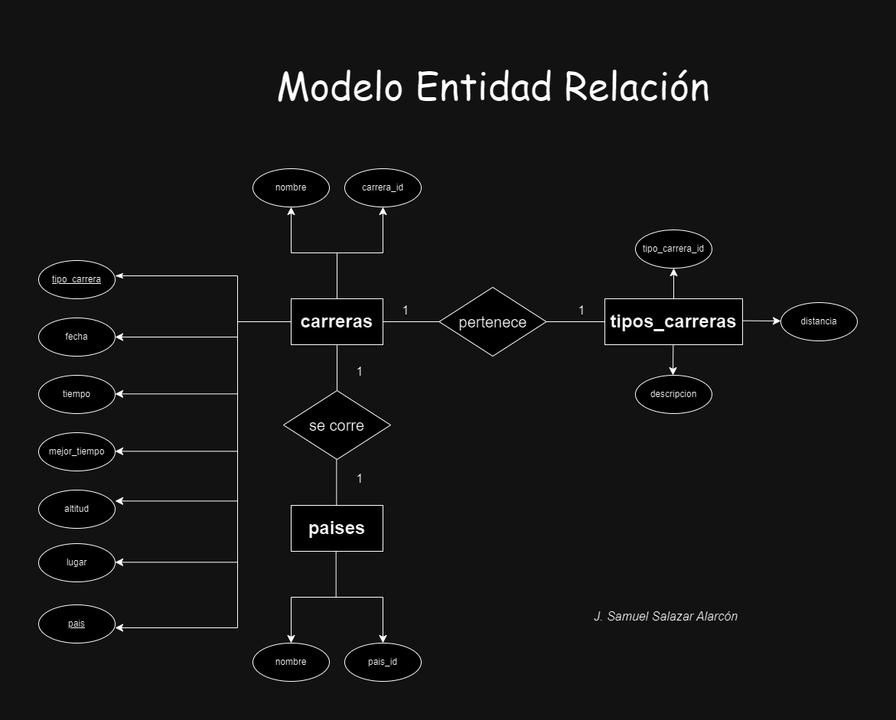
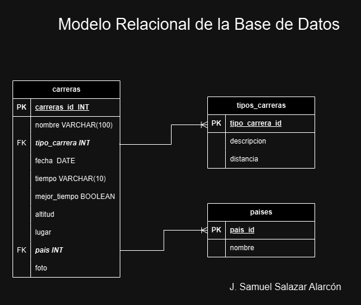

# carreras

<!-- Las entidades las ponemos en plural y los atributos en singular.
    Además si hay espacios debemos reemplazarlos con un guión medio -->

## Listado de Entidades

### carreras **(ED)** <!--  Entidad de Datos -->

- carrera_id **(PK)**
- carrera_nombre
- tipo_carrera **(FK)**
- fecha
- tiempo
- mejor_tiempo
- altitud
- lugar
- pais **(FK)**
- foto

### tipos_carreras **(EC)** <!-- Entidad Catalogo -->

- tipo_carrera_id **(PK)**
- descripcion
- distancia **(UQ)**

### Paises **(EC)** <!-- Entidad Catalogo -->

- pais_id **(PK)**
- nombre

## Glosario

- **PK** _Primary Key_
- **FK** _Foreign Key_
- **UQ** _Unique Attribute_
- **ED** Entidad de Datos
- **EP** Entidad Pivote
- **EC** Entidad Catálogo

## Relaciones

1. Una **carrera** _Pertenece_ a un tipo de carrera. (1 a 1)
1. Una **carrera** se _corre_ en un pais. (1 a 1)

## Diagramas

### Modelo Entidad Relación

### Modelo Relacional de la Base de Datos

## Reglas de Negocio

### carreras

1. Crear el registro de una carrera.
1. Leer el registro de una(s) carrera(s) dada una condición en particular.
1. Leer todos registros de la entidad carreras.
1. Actualizar los datos de una carrera.
1. Elimnar los datos de una carrera dada una condición en particular.

### tipos_carreras

1. Crear el registro de un tipo de carrera.
1. Leer el registro de un(os) tipo(s) de carrera(s) dada una condición en particular.
1. Leer todos registros de la entidad tipos de carreras.
1. Actualizar los datos de un tipo de carrera.
1. Elimnar los datos de un tipo carrera dada una condición en particular.

### paises

1. Crear el registro de un pais.
1. Leer el registro de un(os) pais(es) dada una condición en particular.
1. Leer todos registros de la entidad paises.
1. Actualizar los datos de un pais.
1. Elimnar los datos de un pais dada una condición en particular.
