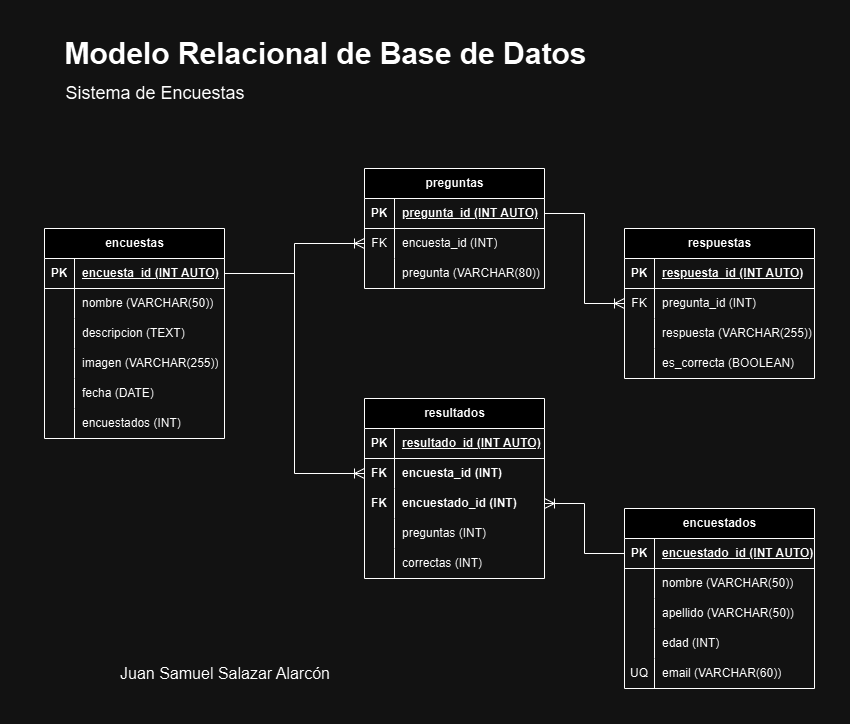

# Encuestas

## Litado en Entidades

### encuestas **(ED)**

- encuesta_id **(PK)**
- nombre
- descripcion
- imagen
- fecha
- encuestados

### preguntas **(ED)**

- pregunta_id **(PK)**
- encuesta_id **(FK)**
- pregunta

### respuestas **(ED)**

- respuesta_id **(PK)**
- pregunta_id **(FK)**
- respuesta
- es_correcta

### encuestados **(ED)**

- encuestado_id **(PK)**
- nombre
- apellido
- edad
- email **(UQ)**

### resultado **(ED|EP)**

- resultado_id **(PK)**
- encuesta_id **(FK)**
- encuestado_id **(FK)**
- preguntas
- correctas

## Relaciones

1. Una **encuesta** tiene **preguntas** (_1 - M_)
1. Una **pregunta** tiene **respuestas** (_1 - M_)
1. Una **encuesta** tiene **resultados** (_1 - M_)
1. Un **escuestado** tiene **resultados** (_1 - M_)

## Modelo Relacional de la BD

## Reglas de Negocio

