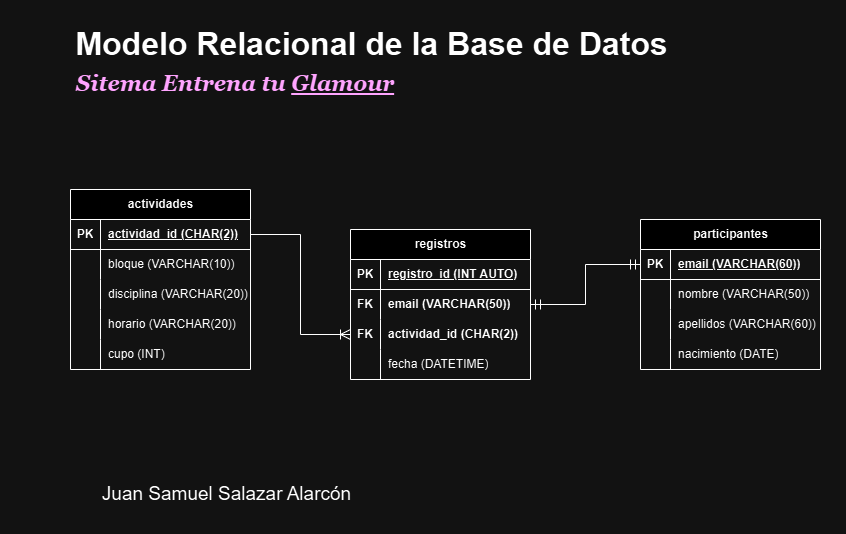

# Sistema Entrena Tu _Glamour_

## Requisitos del Sistema

- Registrar participantes para el evento Entrena tu _Glamour_
- El evento tendrá 4 disciplinas: _Kickboxing_, Pilates, Yoga y Zumba
- Cada disciplina tendrá 3 bloques de horarios:
  - Bloque 1 de 9:00 a 12:00
  - Bloque 2 de 14:00 a 17:00
  - Bloque 3 de 18:00 a 21:00
- Cada actividad tendrá un maximo de 10 participantes, excepto Yoga que tendrá 20.
- Cada participante solo se podrá registrar a una sola actividad

## Listado de Entidades

### 1ra Versión

### participantes **(ED)**

- correo **(PK)**
- nombres
- apellidos
- nacimiento

### disciplinas **(EC)**

- disciplina_id **(PK)**
- disciplina

### bloques **(EC)**

- bloque_id **(PK)**
- bloque
- horario

### disciplinas_x_bloques **(EP)**

- dxb_id **(PK)**
- disciplina_id **(FK)**
- bloque_id **(FK)**
- cupo_maximo
- cupo_actual
- Agotado **(Boolean)**

<!-- La tabla Registros se utiliza para asociar a los participantes con las disciplinas y bloques en los que están inscritos. Su propósito es capturar la relación entre los participantes y las actividades (disciplinas) en los bloques horarios específicos en los que se han registrado. -->

### registros **(ED | EP)**

- registro_id **(PK)**
- correo **(FK)**
- disciplina_id **(FK)**
- bloque_id **(FK)**
- fecha

## Listado de Entidades

### 2da Version

#### Que no esta normalizada, pero esta acorde con lo solicitado. (Leer en código para más info :D )

<!-- En este caso por el tiempo, y por el mero hecho de que era un proyecto de un solo uso (Osea que
solo funcionaria en un rango de tiempo y luego nunca más se utilizaria), hicimos el diseño sin normalizar
pero que funcione y para cubrir la verdadera necesidad de lo que nos pedian. Además es una forma de reflexionar acerca de que aveces debemos tener un equilibrio entre normalizar a full y los requisitos predominantes
que nos piden , ademas del tiempo que este estaria funcionando y no complicarnos tanto.-->

### actividades **(EC)**

- actividad_id **(PK)**
- bloque
- disciplina
- horario
- cupo

| actividad_id | bloque   | disciplina  | horario       | cupo |
| ------------ | -------- | ----------- | ------------- | ---- |
| 1K           | Bloque 1 | KICK BOXING | 9:00 a 12:00  | 10   |
| 1Y           | Bloque 1 | YOGA        | 9:00 a 12:00  | 20   |
| 1P           | Bloque 1 | PILATES     | 9:00 a 12:00  | 10   |
| 1Z           | Bloque 1 | ZUMBA       | 9:00 a 12:00  | 10   |
| 2K           | Bloque 2 | KICK BOXING | 14:00 a 17:00 | 10   |
| 2Y           | Bloque 2 | YOGA        | 14:00 a 17:00 | 20   |
| 2P           | Bloque 2 | PILATES     | 14:00 a 17:00 | 10   |
| 2Z           | Bloque 2 | ZUMBA       | 14:00 a 17:00 | 10   |
| 3K           | Bloque 3 | KICK BOXING | 18:00 a 21:00 | 10   |
| 3Y           | Bloque 3 | YOGA        | 18:00 a 21:00 | 20   |
| 3P           | Bloque 3 | PILATES     | 18:00 a 21:00 | 10   |
| 3Z           | Bloque 3 | ZUMBA       | 18:00 a 21:00 | 10   |

### participantes **(ED)**

- email **(PK)**
- nombre
- apellidos
- nacimiento

### registros **(ED | EP)**

- registro_id **(PK)**
- email **(FK)**
- actividad_id **(FK)**
- fecha

## Relaciones

1. Un **participante** solo tiene un **registro** (_1 - 1_)
<!-- Aqui hice una reformulación para que sea más entendible la relación entre actividad y registro -->
1. Una **actividad** se asigna a muchos **registros**, pero cada **registro** está asociado a una sola **actividad**. (_1 - M_)

### Importancia de Formular Bien

una formulación clara y precisa de las relaciones en el diseño de bases de datos es crucial para asegurar la integridad, eficiencia, y escalabilidad del sistema. Facilita la comprensión, optimiza el rendimiento, y mejora la comunicación y el mantenimiento del sistema. Al invertir el tiempo necesario para definir estas relaciones de manera adecuada, se sientan las bases para un sistema de base de datos robusto y eficaz.

## Modelo Relacional de la BD

## Reglas de Negocio (CRUD)

### actividades

1. Crear una actividad.
1. Leer todas las actividades.
1. Leer una actividad en particular.
1. Actualizar una actividad.
1. Eliminar una actividad.

### participantes

1. Crear un participante.
1. Leer todos los participantes.
1. Leer un participante en particular.
1. Actualizar un participante.
1. Eliminar un participante.

### registros

1. Crear un registro.
1. Leer todos los registros.
1. Leer un registro en particular.
1. Actualizar un registro.
1. Eliminar un registro.

### Lógica y Validaciones de Requisitos

- Registrar un participante implica :
  - Validar cupo de la actividad.
  - Insertar datos a las entidades participantes y registros.
  - Restarle uno al atributo cupo de la entidad actividades.
- Listar registros.
- Eliminar participante .implica:
  - Eliminar datos a las entidades participantes y registros.
  - Sumarle uno al atributo cupo de la entidad actividades.
