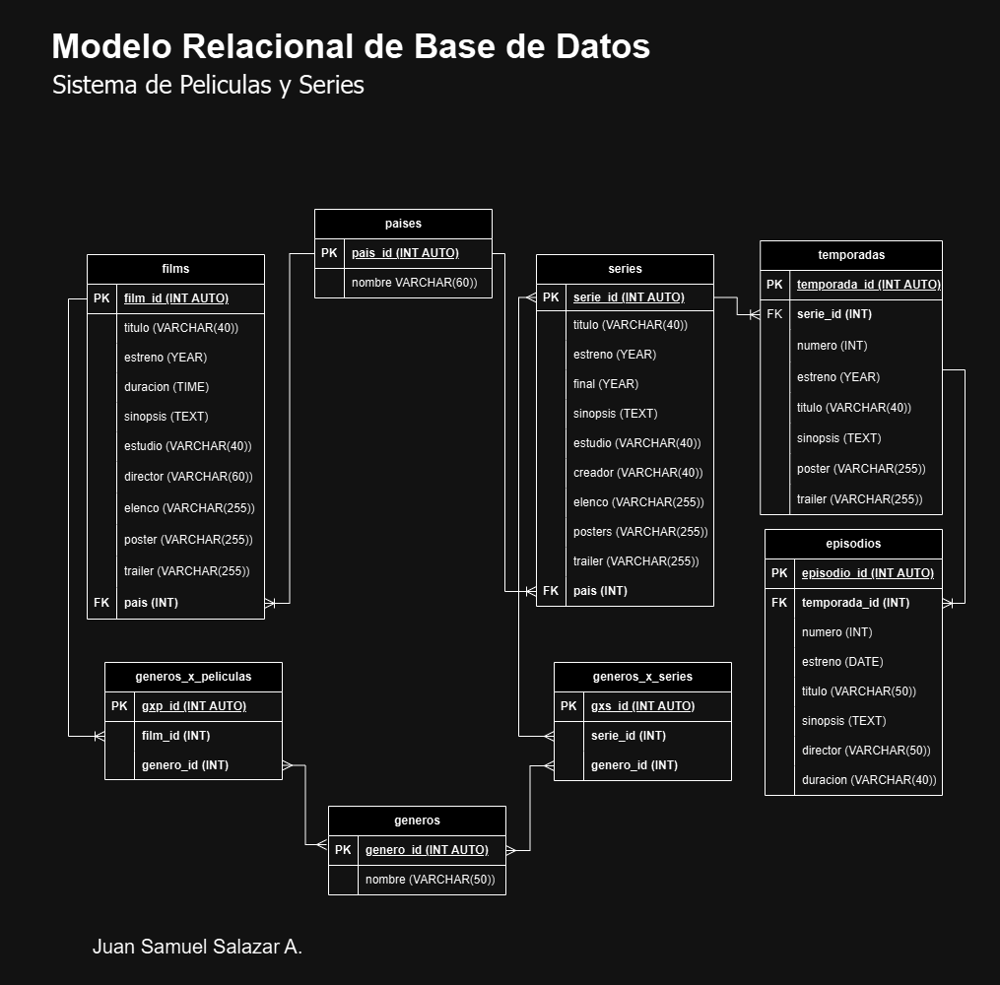

# FilmSeries

## Listado de Entidades

### films **(ED)**

- film_id **(PK)**
- titulo
- estreno
- duracion
- sinopsis
- estudio
- director
- elenco
- poster
- trailer
- pais **(FK)**

### series **(ED)**

- serie_id **(PK)**
- titulo
- estreno
- final
- sinopsis
- estudio
- creador
- elenco
- poster
- trailer

### temporadas **(ED)**

- temporada_id **(PK)**
- serie_id **(FK)**
- numero
- estreno
- titulo
- sinopsis
- poster
- trailer

### episodios **(ED)**

- episodio_id **(PK)**
- temporada_id **(FK)**
- numero
- estreno
- titulo
- sinopsis
- director
- duracion

### paises **(EC)**

- pais_id **(PK)**
- nombre

### generos **(EC)**

- genero_id **(PK)**
- nombre

### generos_x_peliculas **(EP)**

- gxp_id **(PK)**
- film_id **(FK)**
- genero_id **(FK)**

### generos_x_series **(EP)**

- gxs_id **(PK)**
- serie_id **(FK)**
- genero_id **(FK)**

## Relaciones

<!-- Una pelicula tiene un pais, pero un pais puede tener varias peliculas -->
1. Una **pelicula** tiene un **pais** (_M - 1_)
<!-- Una serie tiene un pais, pero un pais tiene varias series -->
1. Una **serie** tiene un **pais** (_M - 1_)
<!-- Una temporada pertenece a una serie, y la serie puede tener varias temporadas -->
1. Una **temporada** pertenece a **serie** (_M - 1_)
<!-- un episodio pertenece a una temporada, pero la temporada puede tener varios episodios -->
1. un **episodio** pertenece a una **temporada** (_M - 1_)
<!-- las peliculas pertenecen a generos, y los generos pueden estar en varias peliculas -->
1. **peliculas** pertenecen a **generos** (_M - M_)
<!-- las series pertenecer a generos, y los generos pueden estar en varias series -->
1. **series** pertenecen a **generos** (_M - M_)

## Modelo Relacional de la BD

## Reglas de Negocio

### peliculas

1. Crear un pelicula.
1. Leer todas las peliculas.
1. Leer una pelicula en particular.
1. Actualizar una pelicula.
1. Eliminar una pelicula.

### series

1. Crear una serie.
1. Leer todas las series.
1. Leer una serie en particular.
1. Leer las temporadas de una serie.
1. Actualizar una serie.
1. Eliminar una serie.
1. Leer los episodios de una serie.

### temporadas

1. Crear una temporada.
1. Leer todas las temporadas.
1. Leer una temporada en particular.
1. Leer los episodios de una temporada.
1. Actualizar una temporada.
1. Eliminar una temporada.

### episodios

1. Crear un episodio.
1. Leer todos los episodios.
1. Leer un episodio en particular.
1. Actualizar un episodio.
1. Eliminar un episodio.

### paises

1. Crear un pais.
1. Leer todos los paises.
1. Leer un pais en particular.
1. Actualizar un pais.
1. Eliminar un pais.

### generos

1. Crear un género.
1. Leer todos los géneros.
1. Leer un género en particular.
1. Actualizar un género.
1. Eliminar un género.

### generos_x_peliculas

1. Crear un gxp.
1. Leer los géneros de una película.
1. Eliminar un gpx.

### generos_x_series

1. Crear un gxs.
1. Leer los géneros de una serie.
1. Eliminar un gxs.
