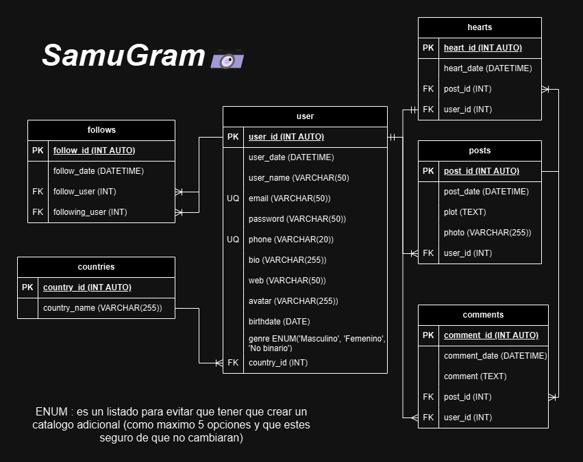

# SamuGram

## Listado de Entidades

### posts **(ED)**

- post_id
- post_date
- plot
- photo
- user_id **(FK)**

### user **(ED)**

- user_id **(PK)**
- user_date
- user_name
- email **(UQ)**
- password
- telefono **(UQ)**
- bio
- web
- avatar
- birthdate
- genre
- country **(FK)**

### countries **(EC)**

- country_id **(PK)**
- country_name

### hearts **(ED | EP)**

- heart_id **(PK)**
- heart_date
- post_id **(FK)**
- user_id **(FK)**

### follows

- follow_id **(PK)**
- follow_date
- follow_user **(FK)**
- following_user **(FK)**

### comments **(ED | EP)**

- comment_id **(PK)**
- comment_date
- comment
- post_id **(FK)**
- user_id **(FK)**

## Relaciones

<!--  Tenemos que verlo desde la perspectiva que queremos darle, por ejemplo en users otorgan hearts decimos que los users pueden otorgar un corazon y ese corazon proviene de ese unico user. Un post tiene hearts pero esos hearts solo estan en ese unico post -->

1. Los **users** publican muchos **posts** y estos son de ese unico user(_1 - M_)
1. Los **users** escriben muchos **commments** y estos pertenecen a ese unico user (_1 - M_)
1. Los **posts** tienen muchos **comments** y estos comentarios pertenecen a ese unico post (_1 - M_)
1. Los **users** otorgan un **hearts** y estos provienen de ese unico user (_1 - 1_)
1. Los **posts** tienen **hearts** y estos pertenecen a un post (_1 - M_)
1. Los **users** tienen **follows** y estos follows pertenecen a ese usuario (_1 - M_)
1. Los **users** siguen **follows** y estos pertenecen a ese usuario (_1 - M_)
1. Los **users** tienen un **countries** y los paises pueden pertenecer a muchos usuarios(_M - 1_)

## Modelo Relacional de la BD

## Reglas de Negocio

### posts

1. Crear un post.
1. Leer todos los posts.
1. Leer un post en particular.
1. Leer los post de un user.
1. Actualizar el plot de un post.
1. Eliminar post.

### users

1. Crear un user.
1. Leer todos los users.
1. Leer un user en particular.
1. Valir un user.
1. Actualizar datos del user.
1. Actualizar password de user.
1. Eliminar user.

### comments

1. Crear un comment en un post.
1. Leer todos los comments de un post.
1. Leer un comment de un post.
1. Contar el número de comments de un post.
1. Eliminar comment de un post.

### hearts

1. Crear heart de user en un post.
1. Contar el número de hearts de un post.
1. Eliminar heart de user en un post.

### follows

1. Crear follow de un user.
1. Contar el número de followers de un user.
1. Contar el número de Followings de un user.
1. Eliminar follow de un user.

### countries

1. Crear country.
1. Leer todos los countries.
1. Leer un country.
1. Actualizar un country.
1. Eliminar country.
