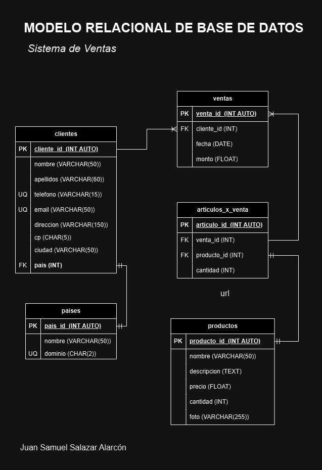

# ventas

## Listado de Entidades

### clientes **(ED)**

- cliente_id **(PK)**
- nombre
- apellidos
- telefono **(UQ)**
- email **(UQ)**
- direccion
- cp
- ciudad
- pais **(FK)**

### productos **(ED|EC)**

- producto_id **(PK)**
- nombre
- descripcion
- precio
- cantidad <!-- El stock -->

### ventas

- venta-id **(PK)**
- cliente_id **(FK)**
- fecha
- monto

### articulos_x_venta **(EP)**

- articulo_id **(PK)**
- venta_id **(FK)**
- producto_id **(FK)**
- cantidad <!-- Cuantos articulos de ese producto esta comprando el usuario -->

### paises **(EC)**

- pais_id **(PK)**
- nombre
- dominio **(UQ)**

## Relaciones

<!-- Dependiendo de la perspectiva de cual es la entidad que mas te interesa tener el control las relaciones pueden cambiar. -->

1. Un **cliente** tiene **pais** (_1 - 1_ )<!-- Un cliente solo tiene un pais -->
1. Un **cliente** genera **venta** (_1 - M_)
1. Una **venta** tiene **articulo** (_1 - M_)
1. Un **articulo** es un **producto** (_1 - 1_)

## Diagramas

### Modelo Relacional de la BD

## Reglas de negocio

### clientes

1. Crear un cliente.
1. Leer todos los clientes.
1. Leer un cliente en particular.
1. Actualizar un cliente.
1. Eliminar un cliente.

### productos

1. Crear un producto.
1. Leer todos los productos.
1. Leer un producto en particular.
1. Actualizar un producto.
1. Eliminar un producto.
1. Cada que haya una venta restar a la cantidad de productos disponibles, el número de articulos que se vendieron.

### ventas

1. Crear una venta.
1. Leer todos las ventas.
1. Leer una venta en particular.
1. Leer todas las ventas de un cliente.
1. Leer todas las ventas de un producto.
1. Actualizar una venta.
1. Eliminar una venta.

### articulos_x_venta

1. Crear un articulo.
1. Leer todos los articulos.
1. Leer un articulo en particular.
1. Leer todos los articulos de una venta.
1. Leer todos los articulos de un producto.
1. Leer todos los articulos de un cliente.
1. Actualizar un articulo.
1. Eliminar un articulo.

### paises

1. Crear un pais.
1. Leer todos los paises.
1. Leer un pais en particular.
1. Actualizar un pais.
1. Eliminar un pais.
